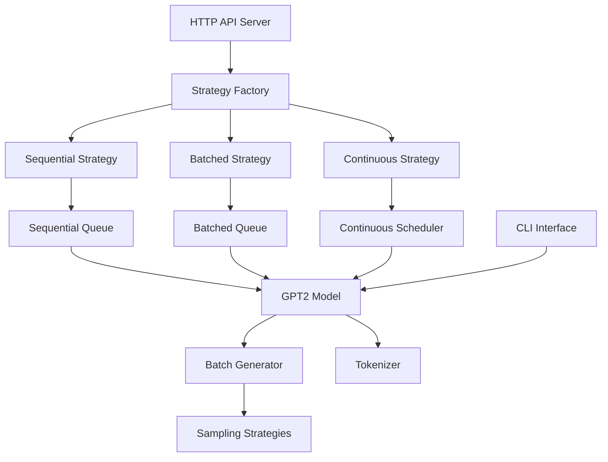

# RuvonVLLM

An educational inference engine built from scratch, demonstrating modern LLM serving techniques inspired by systems like vLLM. This miniature but real system can load pretrained transformer models (starting with GPT-2 124M → scaling to GPT-2 XL 1.5B with a final goal to be able to run gpt-oss on a truly production quality deployment), tokenize user prompts, run efficient prefill and incremental decode passes, and serve generations over an HTTP API with streaming, batching, and telemetry. The core focus is not training new models, but serving existing ones efficiently while learning the concepts behind: paged KV-cache allocation for memory reuse, continuous batching schedulers so new requests can join mid-flight, and fused decode kernels for speed.


## Quick Start

```bash
# Setup environment
make setup

# Run CLI interface
make run-cli

# Start API server
make run-api

# Run tests
make test-all

# Format and lint
make fmt && make lint
```

## Documentation

📚 **[Complete 20-Part Series Guide](docs/introduction.md)**

A comprehensive journey from basic text generation to production-ready inference serving. Each part builds on the previous ones, covering:

- **Foundation** (Parts 1-3): Basic generation, memory optimization, KV-cache
- **API & Sampling** (Parts 4-5): HTTP server, sampling strategies
- **Concurrent Processing** (Parts 6-8): Sequential, batched, and continuous processing
- **Advanced Optimizations** (Parts 9-20): FlashAttention, model parallelism, quantization, and more

The introduction provides learning paths for beginners, experienced developers, and system architects.

## Project Status

✅ **Part 1-8 Complete** - Core inference engine with batching
🚧 **Part 9-20 In Progress** - Advanced optimizations and scaling

See [TODO.md](TODO.md) for the complete 20-part roadmap.

## Architecture



## License

MIT License - see LICENSE file for details.
