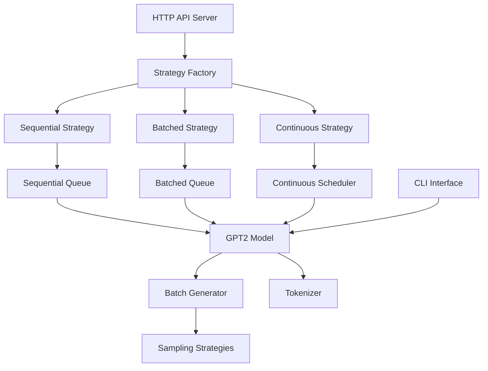

# RuvonVLLM

A tiny vLLM-style inference engine built from scratch — a miniature but real system that can load pretrained transformer models (starting with GPT-2 124M → scaling to GPT-2 XL 1.5B with a final goal to be able to run gpt-oss on a truly production quality deployment), tokenize user prompts, run efficient prefill and incremental decode passes, and serve generations over an HTTP API with streaming, batching, and telemetry. The core focus is not training new models, but serving existing ones efficiently: implementing a paged KV-cache allocator for memory reuse, a continuous batching scheduler so new requests can join mid-flight, and a Triton-based fused decode kernel for speed.


## Quick Start

```bash
# Setup environment
make setup

# Run CLI interface
make run-cli

# Start API server
make run-api

# Run tests
make test-all

# Format and lint
make fmt && make lint
```

## Documentation

### Core Articles

- [Part 1: Tokenizer + Single Forward Pass](docs/part1-article.md)
- [Part 2: Greedy Decode Loop](docs/part2-article.md)
- [Part 3: KV-Cache (Single Request)](docs/part3-article.md)
- [Part 4: HTTP Server (FastAPI)](docs/part4-article.md)
- [Part 5: Sampling (temp, top-k, top-p)](docs/part5-article.md)
- [Part 6: Multiple Sequential Requests](docs/part6-article.md)
- [Part 7: Prefill Batching](docs/part7-article.md)
- [Part 8: Continuous Batching](docs/part8-article.md)

### Advanced Topics

- [Advanced Attention Mechanisms](docs/part3-advanced-attention.md)
- [Advanced Entropy and Sampling](docs/part5-advanced-entropy.md)
- [Technical Glossary](docs/glossary.md)

## Project Status

✅ **Part 1-8 Complete** - Core inference engine with batching
🚧 **Part 9-20 In Progress** - Advanced optimizations and scaling

See [TODO.md](TODO.md) for the complete 20-part roadmap.

## Architecture



## License

MIT License - see LICENSE file for details.
