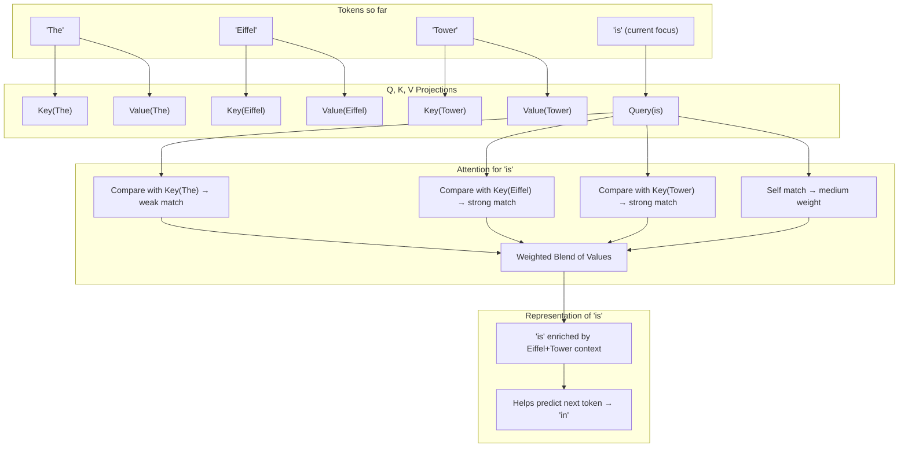

# Part 3 Advanced Addendum: What Exactly is "Attention" and How Does KV-Cache Work?

*A deep dive into the mathematical foundations of transformer attention and why caching is so powerful*

**Important Note**: Our educational inference engine uses HuggingFace's transformers library with GPT-2, not custom attention implementations. This article provides educational background on how attention works in general, not our specific implementation details.

Our Part 3 article showed that KV-caching delivers significant speedup by avoiding "redundant attention computations." But what exactly **is** attention, and why does caching the K and V matrices work so well? Let's dive into the conceptual details.

## Attention: The Mathematical Foundation

### The Attention Equation

At its core, attention in transformers is computed using this equation:

```
Attention(Q, K, V) = softmax(QK^T / √d_k)V
```

Where:
- **Q** (Query): "What am I looking for?"
- **K** (Key): "What information is available?"
- **V** (Value): "What information should I retrieve?"
- **d_k**: Dimension of the key vectors (for scaling and numerical stability)

### What This Actually Means

Think of attention as a **smart library system**:

#### The Library Analogy (Simple Version)

Imagine you're in a magical library where books can talk to each other:

1. **You ask a question** (Query): "What books contain information relevant to my topic?"
2. **Books respond** (Keys): Each book says "I contain information about X, Y, Z"
3. **You get the knowledge** (Values): Books that match your question share their knowledge
4. **Smart weighting**: Instead of just one book answering, you get a blend of knowledge from multiple relevant books

#### In Transformer Terms

- **Query (Q)**: Current word asks "What previous words should I pay attention to?"
- **Key (K)**: Each previous word advertises "Here's what I represent" (its meaning/content)
- **Value (V)**: Each previous word says "Here's the information I'll contribute"

#### Why "Content-Addressable"?

**Regular computer memory**: You access information by location (like "give me what's in slot #5")

**Content-addressable memory**: You access information by meaning (like "give me anything related to 'time'")

The word "content" here means the **semantic meaning or concept** that each word represents, not just its spelling. So "time" might be related to "hour", "moment", "when", etc. based on learned patterns from training.

The **QK^T** multiplication computes similarity scores between the current word and all previous words based on their learned meanings. The **softmax** converts these into probabilities (like confidence scores). Finally, these probabilities weight the **Values** to produce a smart blend of relevant information.


### A Rich Example: *The Eiffel Tower is in Paris.*

To make attention more concrete, let’s look at a real sentence:

> **“The Eiffel Tower is in Paris.”**

We’ll focus on the word **“is”** and show how attention helps it use earlier tokens.

---

#### Step 1: Build Queries, Keys, and Values

* Each token (“The,” “Eiffel,” “Tower,” “is”) generates its own **Query, Key, and Value vectors**.
* Think of this as:

  * **Query** = the *question* the token asks (e.g., *“Who should I pay attention to?”*)
  * **Key** = the *tag* each token carries so others can recognize it
  * **Value** = the *payload* of meaning a token contributes if chosen

---

#### Step 2: Compare Query(“is”) with earlier Keys

* “is” produces a Query vector.
* That Query is compared against all Keys from earlier tokens:

  * Weak match with “The”
  * Strong match with “Eiffel”
  * Strong match with “Tower”

---

#### Step 3: Turn matches into weights

* The similarity scores are normalized into probabilities using softmax:

| Token     | Attention Weight from "is" |
| --------- | -------------------------- |
| The       | Low weight                 |
| Eiffel    | High weight                |
| Tower     | High weight                |
| is (self) | Medium weight              |

So "is" looks mostly at **Eiffel + Tower**, with some weight on itself and minimal attention to "The".

---

#### Step 4: Blend Values

* Those weights are used to blend the **Values** from each token.
* The blended output becomes the new representation for “is,” enriched with the context *“Eiffel Tower.”*
* This enriched vector is then used to help predict the **next word** → “in.”

---

#### Diagram: How “is” attends to Eiffel + Tower



---

#### Why this matters

* Attention is **not hardcoded**: the model learns to make “Eiffel” and “Tower” match strongly during training.
* At runtime, those matches become attention weights.
* The values pulled in shape the hidden representation of “is,” guiding the model to predict the right continuation.


## Multi-Head Attention: Parallel Processing

Now that we’ve seen how a single attention head links “is” back to “Eiffel Tower,” let’s zoom out. GPT-2 doesn’t just run one attention process — it runs twelve of them in parallel. Each head learns to capture different types of relationships (syntax, semantics, long-range structure), and their outputs are combined to form a richer representation.

**Multi-Head Attention Concept:**
- GPT-2 uses 12 attention heads, each with 64 dimensions (768/12 = 64)
- Each head learns different types of relationships between tokens
- The model projects input to Query, Key, Value matrices for each head
- Attention is computed in parallel across all heads
- Results are concatenated and projected to produce the final output

Each of the 12 heads learns to focus on different types of relationships:
- **Head 1**: Maybe syntax relationships ("the" → "cat")
- **Head 2**: Maybe semantic relationships ("happy" → "joy")
- **Head 3**: Maybe long-range dependencies (sentence structure)

## Why KV-Cache Works: The Invariant Property

Here's the crucial insight: **During autoregressive generation, the K and V matrices for past tokens never change.**

### Without KV-Cache (Naive Approach)

**Conceptual Process:**
1. **Step 1**: Process 4 input tokens → compute K,V for all 4 → generate next token
2. **Step 2**: Process 5 tokens (4 original + 1 new) → recompute K,V for all 5 → generate next token
3. **Step 3**: Process 6 tokens → recompute K,V for all 6 → generate next token

**Problem**: K,V matrices for past tokens are identical each step, but we recompute them anyway!

### With KV-Cache (Optimized Approach)

**Conceptual Process:**
1. **Step 1**: Process 4 input tokens → compute K,V for all 4 → cache K,V → generate next token
2. **Step 2**: Process 1 new token → compute K,V only for new token → concatenate with cached K,V → generate next token
3. **Step 3**: Process 1 new token → compute K,V only for new token → concatenate with cached K,V → generate next token

**Solution**: Reuse cached K,V matrices from past tokens, only compute for new tokens.
**Speedup Factor:** Dramatic improvement that grows with sequence length

## How Our Implementation Uses KV-Cache

Our educational inference engine leverages HuggingFace's built-in KV-cache support:

1. **Standard Implementation**: We use the `use_cache=True` parameter in HuggingFace's GPT-2 implementation
2. **Cache Management**: HuggingFace handles the complex tensor operations
3. **Memory Efficiency**: The library automatically manages cache growth and device placement

While production systems like vLLM implement advanced optimizations (paged attention, multi-query attention), our educational focus is on understanding the fundamental concepts rather than cutting-edge optimizations.

## Why This Matters for Inference Engines

Understanding attention mechanics helps optimize inference:

1. **Memory allocation**: Know exactly how much cache to allocate
2. **Batch processing**: Group sequences by length for efficiency
3. **Hardware optimization**: K,V cache access patterns matter for GPU
4. **Precision choices**: Keys often need less precision than values
5. **Prefill optimization**: Initial attention computation is different

## The Future: Attention Alternatives

Recent research explores alternatives to full attention:

- **Linear Attention**: O(n) complexity instead of O(n²)
- **Local Attention**: Only attend to nearby tokens
- **Sparse Attention**: Only compute attention for selected positions
- **State Space Models**: Mamba, alternatives to attention entirely

But for now, cached attention with transformers remains the gold standard for high-quality text generation.

---

## Key Takeaways

1. **Attention is content-addressable memory** - Q queries relevant K,V pairs
2. **Multi-head attention runs 12 parallel attention mechanisms** in GPT-2
3. **KV-cache exploits the invariant property** - past K,V never change
4. **Speedup is quadratic** - O(n²) → O(n) complexity transformation
5. **Memory cost is tiny** - cache overhead negligible vs. speedup
6. **Real systems optimize further** - paging, query grouping, precision

Understanding these fundamentals makes the significant speedup we observe not just impressive - but inevitable. When you cache the right computations, physics rewards you with dramatic performance gains.

---

## References

### Academic Papers
- **Vaswani, A., Shazeer, N., Parmar, N., Uszkoreit, J., Jones, L., Gomez, A. N., Kaiser, Ł., & Polosukhin, I. (2017).** *Attention is all you need.* Advances in neural information processing systems, 30. [[Paper]](https://arxiv.org/abs/1706.03762)
  - The foundational paper that introduced the Transformer architecture and the scaled dot-product attention mechanism used in modern language models.

### Educational Resources
- **3Blue1Brown - Attention in transformers, visually explained**
  [[YouTube]](https://www.youtube.com/watch?v=eMlx5fFNoYc)
  - Excellent visual explanation of how attention mechanisms work in transformers, with intuitive animations showing the Q, K, V interactions.

- **Andrej Karpathy - Let's build GPT: from scratch, in code, spelled out**
  [[YouTube]](https://youtu.be/kCc8FmEb1nY?si=clMbtGlLg6YkYn20)
  - Comprehensive walkthrough of building a GPT model from scratch, including detailed implementation of multi-head attention and the mathematical foundations.

### Additional Context
The KV-cache optimization, while not present in the original Transformer paper, emerged from the practical inference optimization community as production systems needed to serve models efficiently. Our implementation follows the standard approach used in modern inference engines like vLLM, FasterTransformer, and Hugging Face's transformers library.

---

## Navigation

← **Back to**: [Part 3: KV-Cache Optimization](part3-article.md) | **Next**: [Part 4: HTTP API Server](part4-article.md) →

---

*Next up: Part 4 will wrap this optimized attention engine in FastAPI, making it accessible to the world.*
